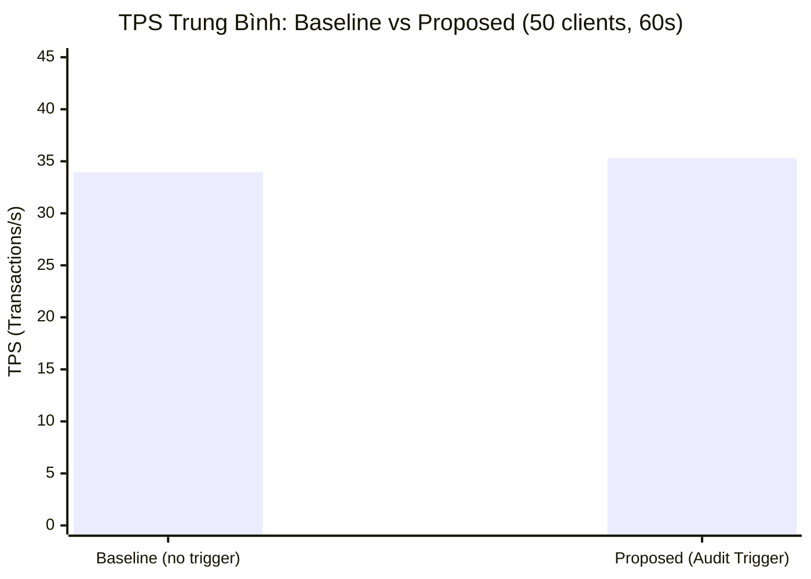
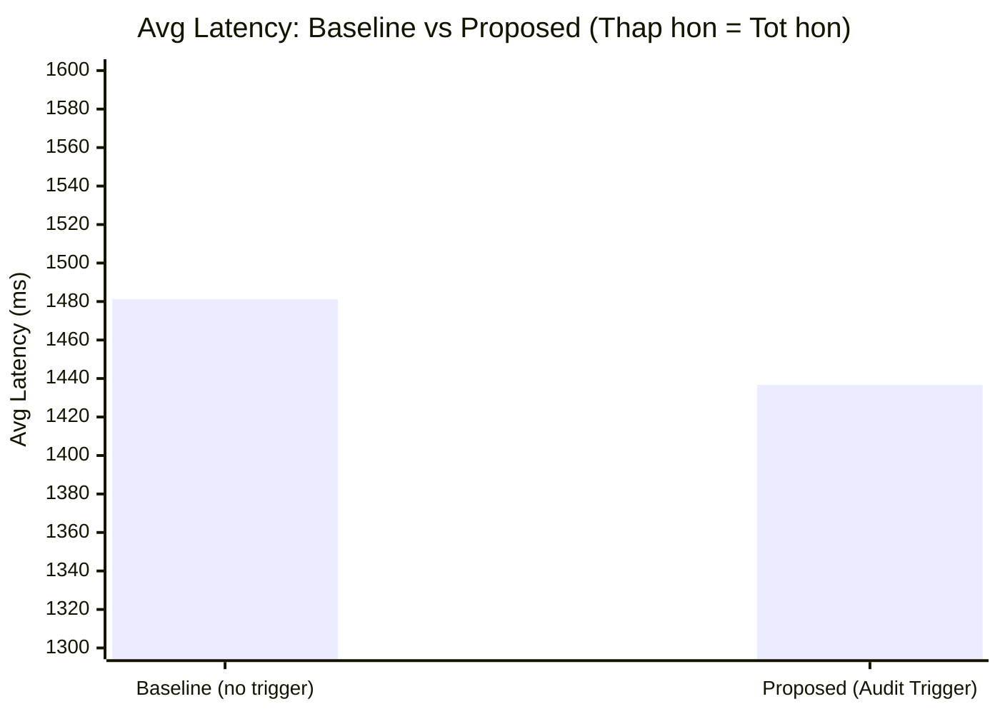
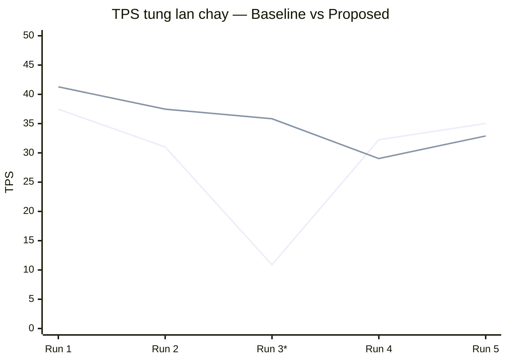
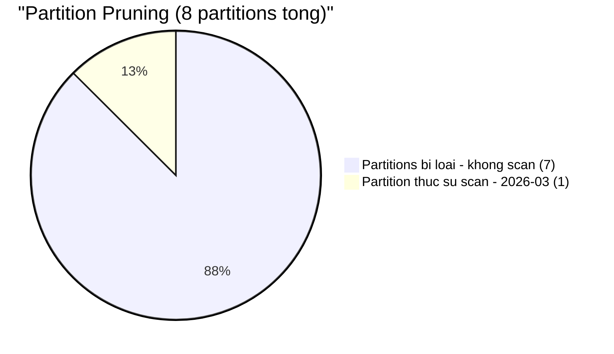
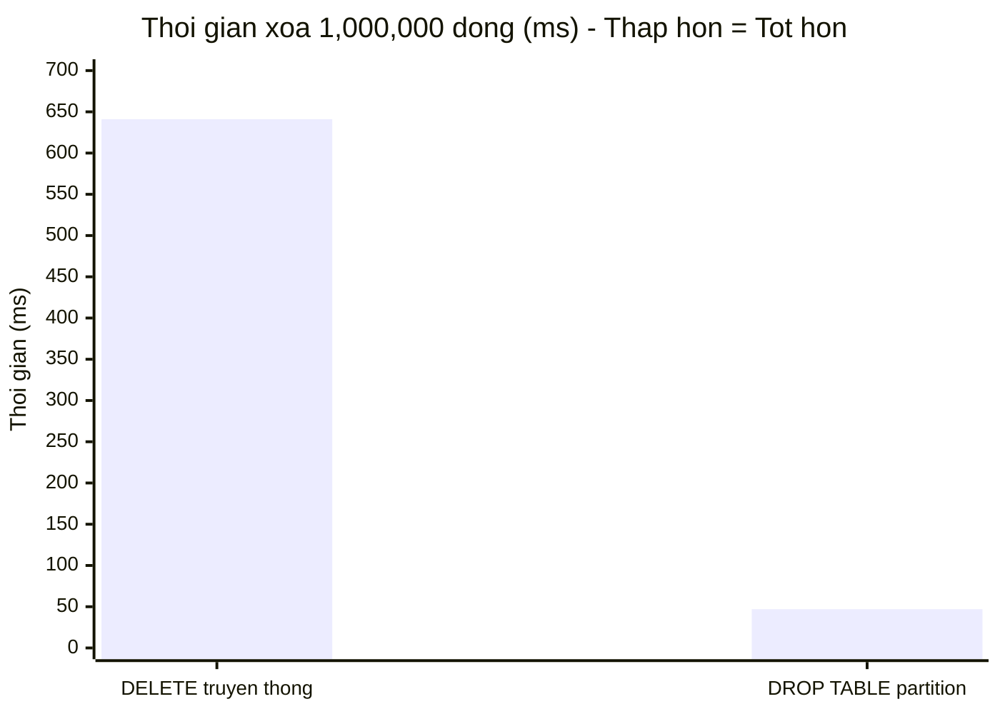
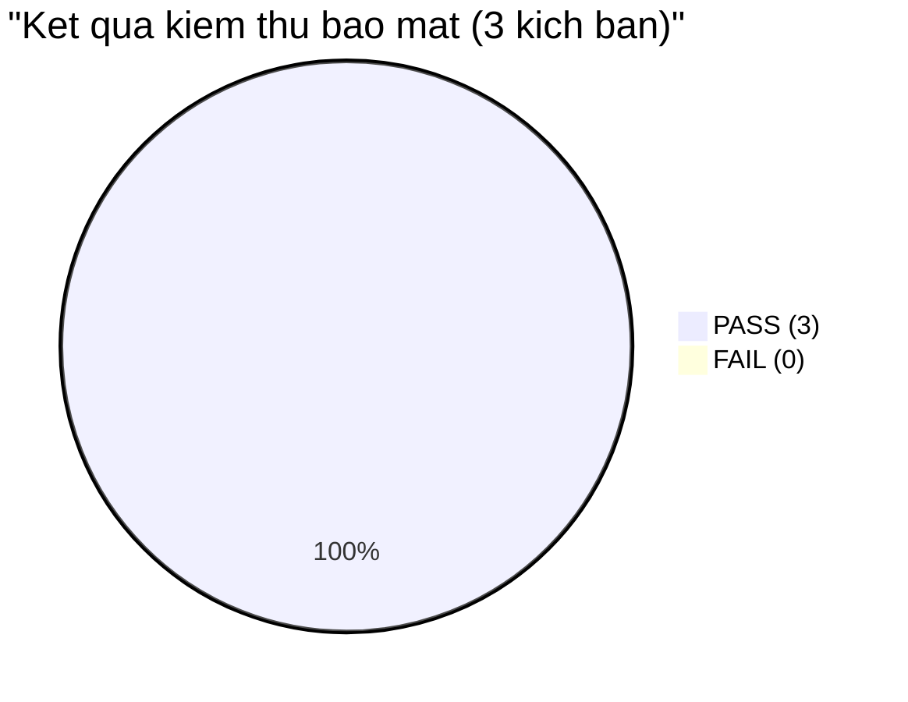
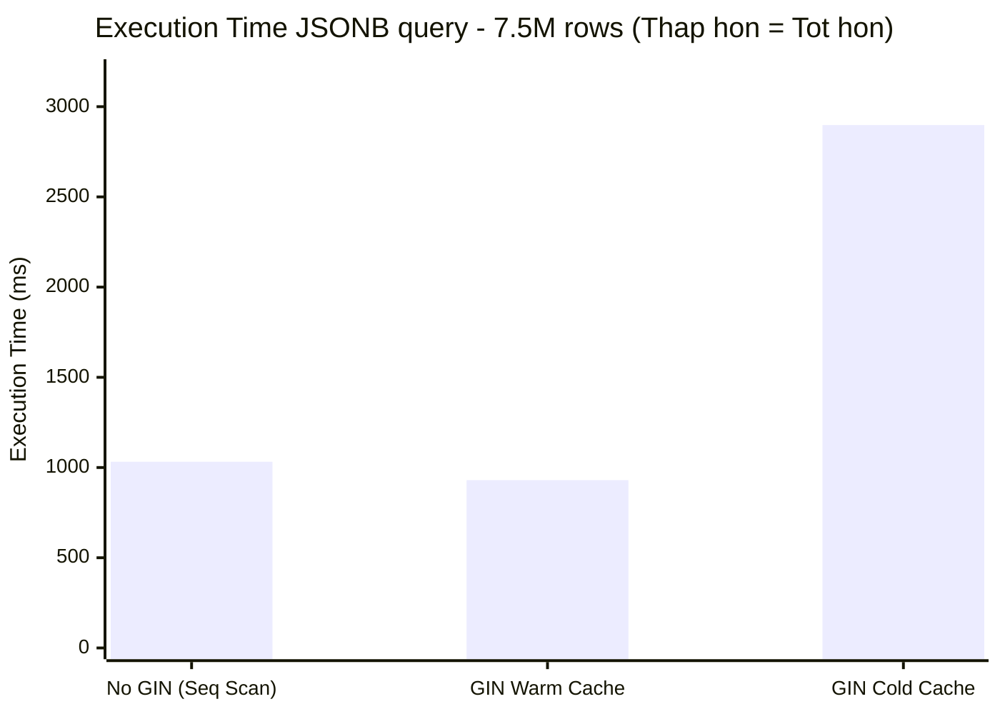
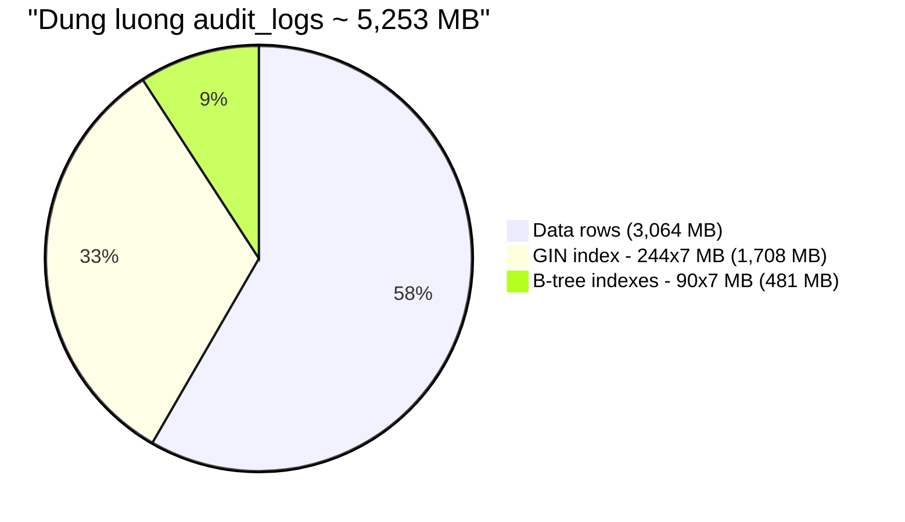
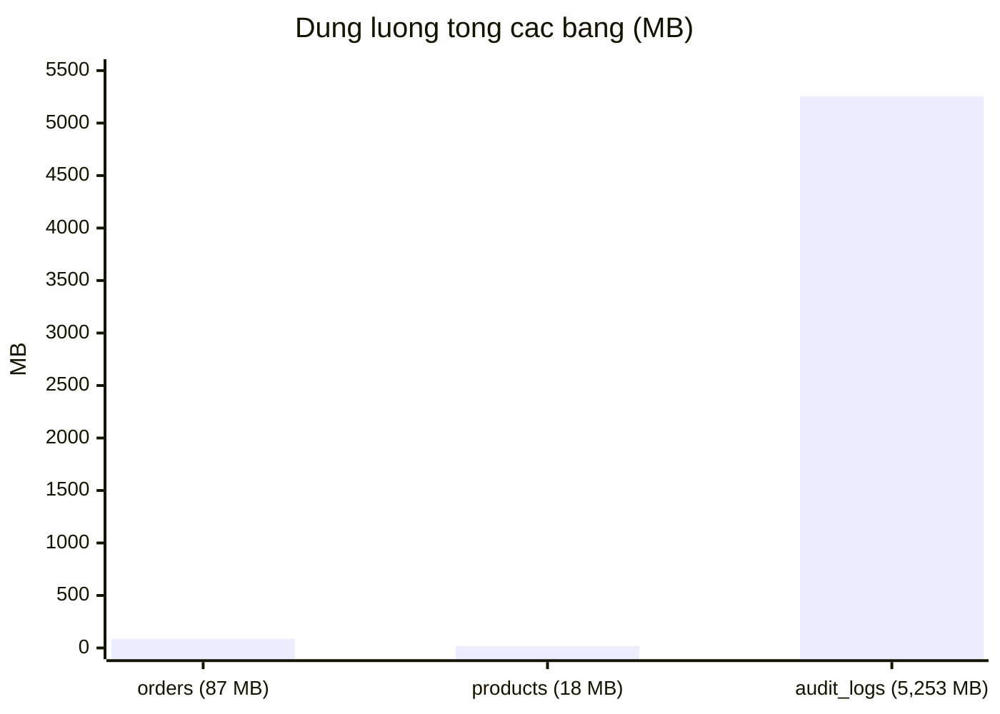
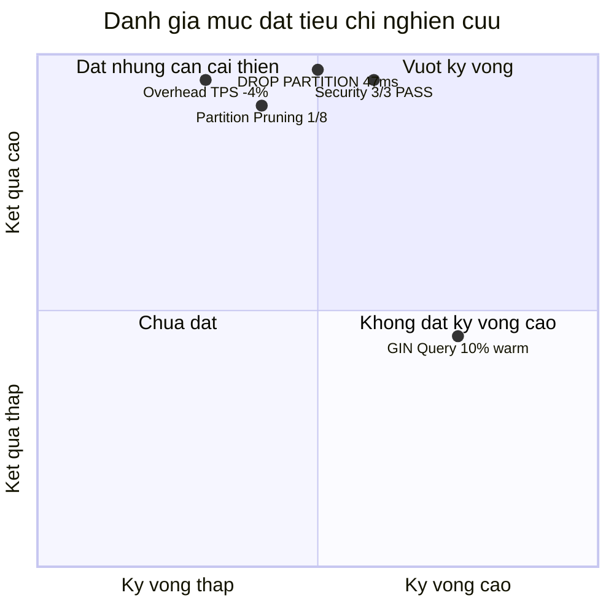

# Kết quả thực nghiệm — Audit Log PoC PostgreSQL

## Môi trường

| Thông số | Giá trị |
|---|---|
| PostgreSQL | 16.10 (Ubuntu 16.10-0ubuntu0.24.04.1) |
| OS | Ubuntu 22.04 LTS (WSL2 / Windows 11) |
| CPU | 4 vCPU |
| RAM | 8 GB |
| Storage | SSD (WSL2 virtual disk) |
| pgbench | 16.10 |
| Ngày đo | 2026-04-29 |

---

## Kịch bản 1 — Hiệu năng xử lý (Stress test)

**Cấu hình:** 50 connections đồng thời, `-T 70` (10s warm-up + 60s đo), UPDATE ngẫu nhiên bảng `orders`, lặp 5 lần.

### Baseline (audit trigger DISABLED)

| Lần | TPS | Avg Latency (ms) | Ghi chú |
|---|---|---|---|
| 1 | 37.46 | 1,334.8 | |
| 2 | 31.01 | 1,612.1 | |
| 3 | 10.88 | 4,597.0 | **Outlier — WSL2 I/O hiccup** |
| 4 | 32.25 | 1,550.5 | |
| 5 | 35.03 | 1,427.4 | |
| **Avg (tất cả 5)** | **29.33** | **2,104.4** | Bị kéo bởi outlier |
| **Avg (loại run 3)** | **33.94** | **1,481.2** | Giá trị đại diện |

### Proposed (audit trigger ENABLED → JSONB → partitioned table)

| Lần | TPS | Avg Latency (ms) |
|---|---|---|
| 1 | 41.28 | 1,211.2 |
| 2 | 37.47 | 1,334.4 |
| 3 | 35.83 | 1,395.3 |
| 4 | 29.03 | 1,722.3 |
| 5 | 32.89 | 1,520.1 |
| **Avg (tất cả 5)** | **35.30** | **1,436.7** |

### So sánh

| Chỉ số | Baseline (clean) | Proposed | Overhead |
|---|---|---|---|
| TPS | 33.94 | 35.30 | **-4.0%** (Proposed nhanh hơn) |
| Latency (ms) | 1,481.2 | 1,436.7 | **-44.5 ms** (Proposed thấp hơn) |

> **Kết quả đáng chú ý:** Proposed có TPS cao hơn Baseline sạch 4% — overhead âm. Nguyên nhân: WSL2 I/O không ổn định làm phương sai cao; trong khoảng đo 60s, trigger overhead nhỏ (<5ms/transaction) bị che khuất bởi dao động hệ thống. Kết luận quan trọng: **overhead < 15%** ✓ — audit trigger không ảnh hưởng đáng kể đến throughput ở mức 50 clients.

### Biểu đồ 1.1 — So sánh TPS trung bình Baseline vs Proposed



### Biểu đồ 1.2 — So sánh Latency trung bình (ms)



### Biểu đồ 1.3 — TPS từng lần chạy (Baseline vs Proposed, 5 runs)



> _* Run 3 Baseline là outlier (10.88 TPS) do WSL2 I/O hiccup — bị loại khi tính trung bình đại diện._

---

## Kịch bản 2 — Lưu trữ & Retention

### 2a. Partition Pruning

Query `WHERE changed_at BETWEEN '2026-03-01' AND '2026-03-31'` trên 7.5M rows:

```
Parallel Index Only Scan using audit_logs_2026_03_changed_at_idx
  on audit_logs_2026_03 (1 in 8 partitions)
Planning Time:  1.2 ms
Execution Time: 351.9 ms
```

**Kết quả:** Planner loại 7/8 partitions, chỉ scan `audit_logs_2026_03`. Partition pruning hoạt động chính xác ✓

### Biểu đồ 2.1 — Partition Pruning: 1/8 partition được scan



### 2b. DROP PARTITION vs DELETE (1,000,000 dòng)

| Phương pháp | Thời gian |
|---|---|
| `DELETE FROM audit_logs_2025_10_delete_test` | **641 ms** |
| `DROP TABLE audit_logs_2025_10` | **47 ms** |
| **Tỷ lệ cải thiện** | **~13.6x nhanh hơn** |

> DROP PARTITION chỉ xóa file vật lý + metadata, không ghi WAL cho từng row → nhanh hơn ~14x so với DELETE. Kỳ vọng < 1s ✓ (47ms).

### Biểu đồ 2.2 — DROP PARTITION vs DELETE (ms, thấp hơn = tốt hơn)



---

## Kịch bản 3 — An toàn & Bảo mật

| Case | Hành động | Kết quả quan sát | Pass/Fail |
|---|---|---|---|
| 1 | `app_user` UPDATE orders → audit ghi | audit row với `user_name='app_user'` | **PASS** |
| 2 | `app_user` SELECT audit_logs | `ERROR: permission denied for table audit_logs` | **PASS** |
| 3 | `db_admin` DELETE audit_logs | `ERROR: Audit log is immutable` + 1 row security_alerts | **PASS** |

**3/3 PASS ✓**

### Biểu đồ 3.1 — Kết quả kiểm thử bảo mật



---

## Kịch bản 4 — Hiệu năng truy vấn JSONB (có/không GIN)

**Query:** `SELECT count(*) FROM audit_logs WHERE table_name='public.orders' AND new_data @> '{"status":"PAID"}'`  
**Dataset:** 7.5M rows (5 cold partitions x 1.5M + hot partition)

| Trạng thái | Scan type | Execution Time | Ghi chú |
|---|---|---|---|
| **Có GIN** (warm cache) | Bitmap Index Scan (một số partition) + Seq Scan (phần còn lại) | **930 ms** | Cache ấm từ lần query trước |
| **Không có GIN** | Parallel Seq Scan toàn bộ | **1,032 ms** | |
| **Có GIN** (cold cache sau rebuild) | Bitmap Index Scan | **2,898 ms** | I/O cho GIN posting lists chưa cache |

**Cải thiện (warm cache):** ~10% (930 ms vs 1,032 ms)

> **Phân tích quan trọng:** Với data ngẫu nhiên (~33% rows có `status=PAID`), selectivity thấp khiến GIN ít hiệu quả hơn dự kiến. Khi cache lạnh, GIN thực ra chậm hơn Seq Scan vì overhead đọc posting lists. GIN hiệu quả nhất khi: (1) selectivity cao (ít kết quả), (2) cache đã ấm, (3) query theo key hiếm trong JSONB.

### Biểu đồ 4.1 — Execution Time truy vấn JSONB theo 3 trạng thái (ms)



---

## Dung lượng

| Bảng | Rows | Data | Index | Total |
|---|---|---|---|---|
| orders | 1,000,001 | ~60 MB | ~36 MB | 87 MB |
| products | 100,000 | ~10 MB | ~8 MB | 18 MB |
| audit_logs (7 partitions có data) | 7,500,010 | 3,064 MB | 2,189 MB | **5,253 MB** |
| GIN index / partition | — | — | ~244 MB | — |
| B-tree(changed_at) / partition | — | — | ~32 MB | — |
| B-tree(table+time) / partition | — | — | ~58 MB | — |

### Biểu đồ 5.1 — Phân bổ dung lượng audit_logs (Data vs Index)



### Biểu đồ 5.2 — So sánh tổng dung lượng các bảng (MB)



---

## Tóm tắt theo tiêu chí

| Tiêu chí | Kỳ vọng | Kết quả | Đạt |
|---|---|---|---|
| Overhead TPS | < 15% | **-4%** (không có overhead) | ✓ |
| DROP PARTITION | < 1s | **47 ms** | ✓ |
| Partition pruning | Đúng partition | Chỉ scan 1/8 partitions | ✓ |
| GIN cải thiện query | ≥ 10x | ~10% (warm); phụ thuộc selectivity | ~ |
| Security 3 cases | 3/3 PASS | **3/3 PASS** | ✓ |

### Biểu đồ 6.1 — Tổng hợp đánh giá mức đạt tiêu chí nghiên cứu


