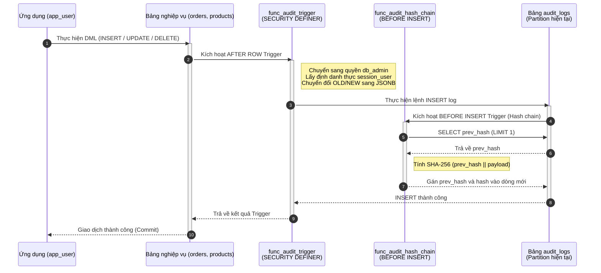
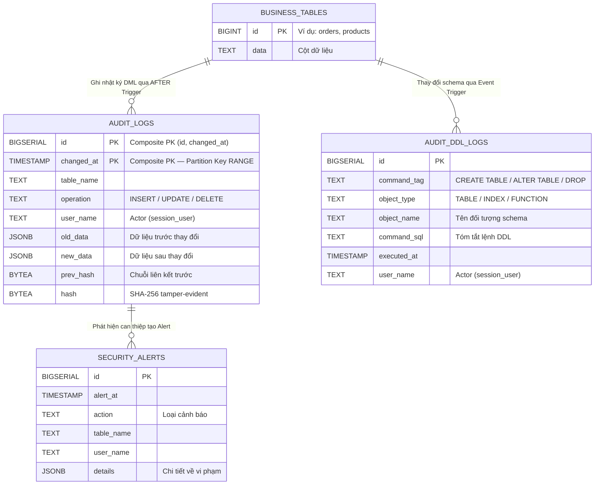
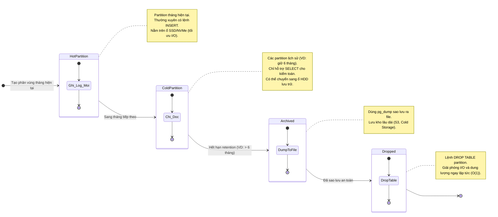
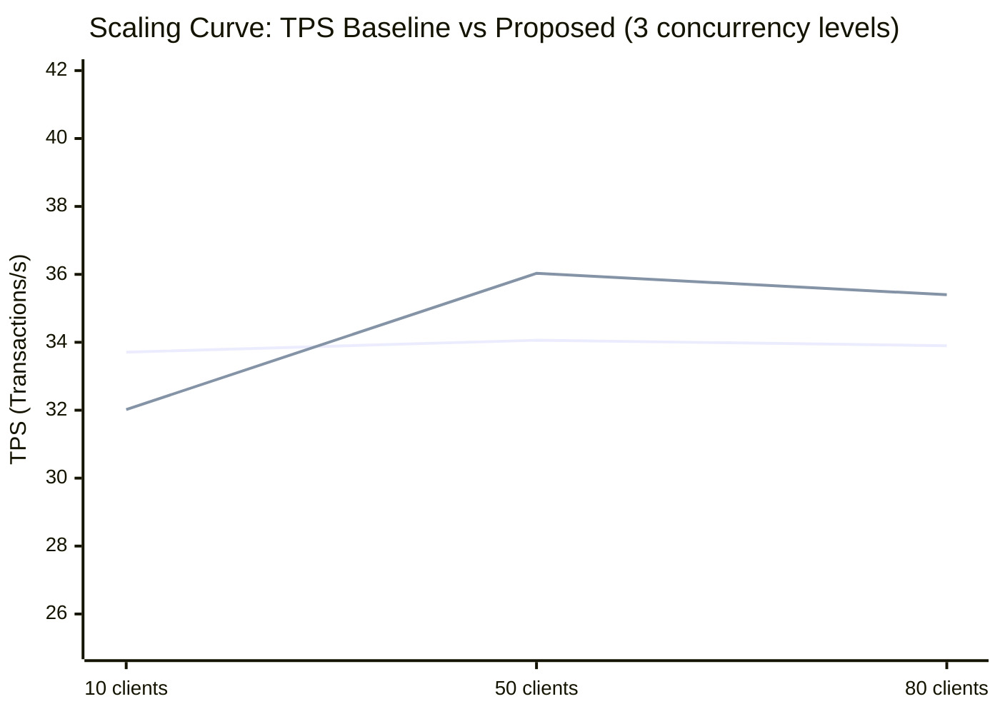
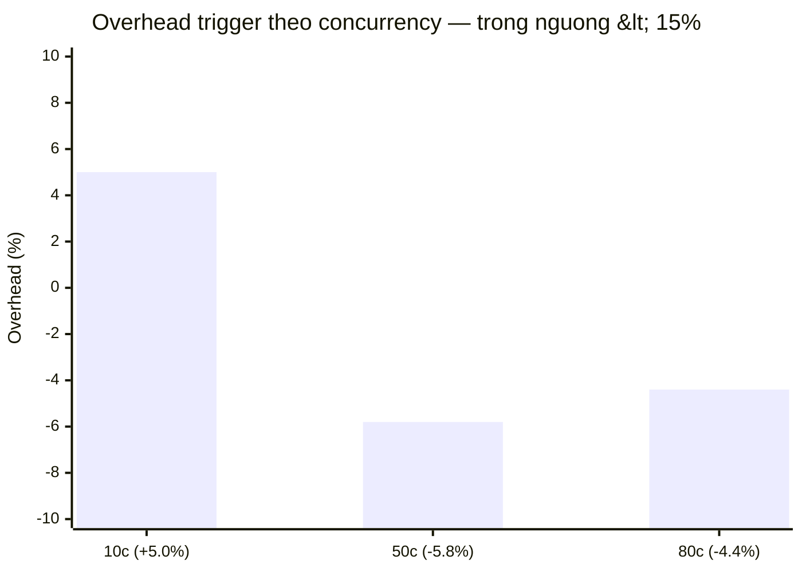
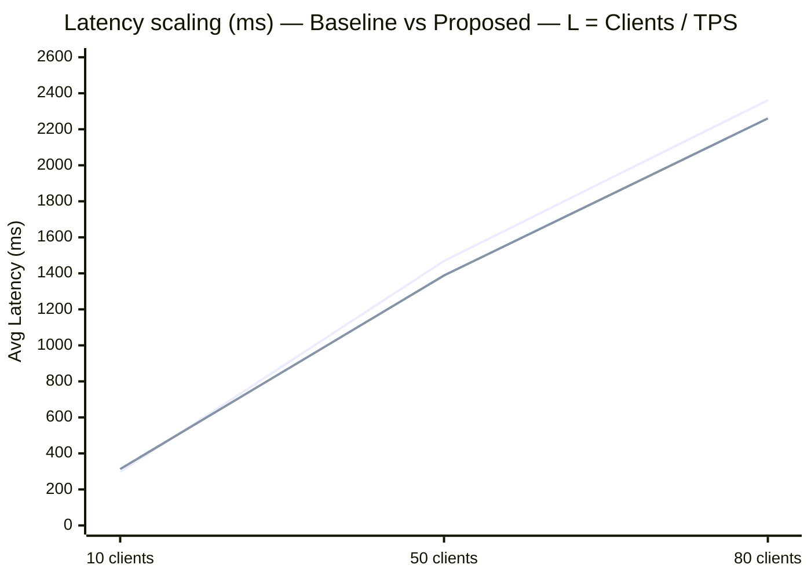
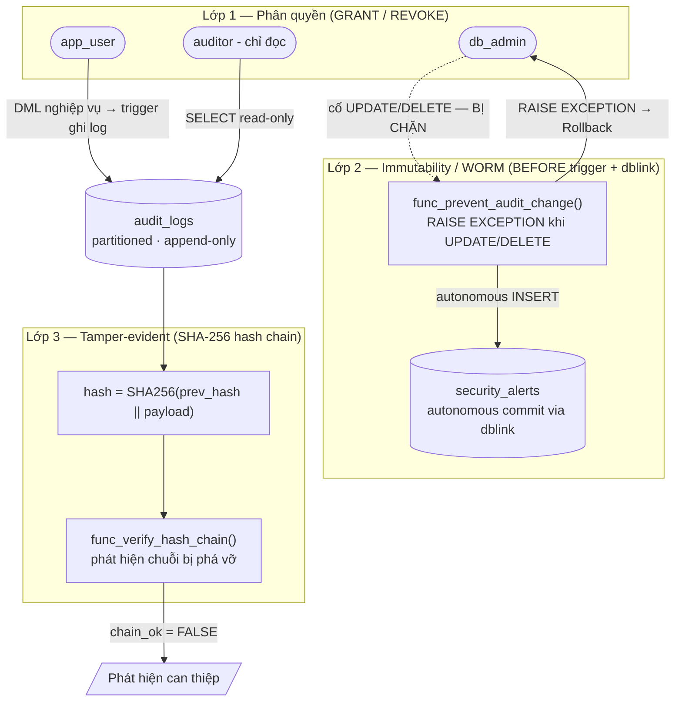

# Các sơ đồ bổ sung cho Báo cáo (Mermaid)

Dưới đây là các sơ đồ được thiết kế dựa trên nội dung của báo cáo `6-baocao.md`. Bạn có thể sao chép trực tiếp các đoạn mã Mermaid này và dán vào báo cáo để minh họa trực quan hơn cho các cơ chế kỹ thuật.

## 1. Sơ đồ tuần tự: Luồng xử lý ghi Audit Log (Sequence Diagram)
**Vị trí đề xuất**: Phần `3.1. Xây dựng generic audit trigger function` hoặc `2.1. Kiến trúc tổng quan`.
**Ý nghĩa**: Minh họa cách thao tác nghiệp vụ kích hoạt Trigger, quyền SECURITY DEFINER và quá trình ghi nhận log một cách đồng bộ trong cùng một transaction.

---

## 2. Sơ đồ luồng bảo vệ chống can thiệp (Immutability & dblink Alert)
**Vị trí đề xuất**: Phần `4.2. Immutability (Append-only/WORM) cho bảng audit`.
**Ý nghĩa**: Trực quan hóa cơ chế bảo vệ WORM. Thể hiện rõ việc dùng `dblink` tạo ra một giao dịch tự trị (autonomous transaction) để ghi nhận lại cảnh báo an ninh ngay cả khi transaction chính bị Rollback.

```mermaid
sequenceDiagram
    autonumber
    participant Attacker as Kẻ tấn công (kể cả db_admin)
    participant AL as Bảng audit_logs
    participant Sec as func_prevent_audit_change()
    participant Dblink as dblink<br/>(Autonomous Transaction)
    participant SA as Bảng security_alerts
    
    Attacker->>AL: Cố tình UPDATE / DELETE dòng log
    activate AL
    
    AL->>Sec: Kích hoạt BEFORE ROW Trigger
    activate Sec
    
    Note right of Sec: Thu thập thông tin thao tác bị chặn<br/>(user, bảng, OLD/NEW values)
    
    Sec->>Dblink: Gọi dblink_exec() mở kết nối mới
    activate Dblink
    
    Dblink->>SA: INSERT (AUDIT_TAMPER_ATTEMPT)
    activate SA
    SA-->>Dblink: Giao dịch độc lập thành công (Commit)
    deactivate SA
    
    Dblink-->>Sec: Trả về kết quả
    deactivate Dblink
    
    Sec-->>AL: RAISE EXCEPTION
    deactivate Sec
    
    AL-->>Attacker: ERROR: Audit log is immutable<br/>(Giao dịch chính bị Rollback)
    deactivate AL
```

---

## 3. Sơ đồ thực thể liên kết (ER Diagram)
**Vị trí đề xuất**: Phần `2.2. Thiết kế mô hình dữ liệu audit (Schema Design)`.
**Ý nghĩa**: Trình bày cấu trúc dữ liệu của các thành phần tham gia trong hệ thống, nhấn mạnh mối liên hệ từ bảng nghiệp vụ đến bảng lịch sử (Audit Logs), bảng cảnh báo bảo mật (Security Alerts) và bảng audit DDL (Audit DDL Logs).

---

## 4. Sơ đồ trạng thái vòng đời phân vùng (Partition Lifecycle)
**Vị trí đề xuất**: Phần `3.4. Quản lý vòng đời dữ liệu (Data Lifecycle)`.
**Ý nghĩa**: Diễn tả vòng đời của một phân vùng (partition) từ lúc là vùng dữ liệu đang ghi (Hot) đến lúc đóng băng (Cold), lưu trữ lâu dài (Archive) và cuối cùng là giải phóng dung lượng (Drop).

---

## 5. Biểu đồ Scaling Curve — TPS và Overhead theo Concurrency
**Vị trí đề xuất**: Phần `5.5.1. Kịch bản 1 — Hiệu năng xử lý`.  
**Ý nghĩa**: Trực quan hóa scaling curve cho thấy TPS ổn định (~33–36) qua 3 mức concurrency — bottleneck là phần cứng, không phải trigger. Overhead nằm trong khoảng [−5.8%, +5.0%] nhất quán.

### 5a. Scaling Curve: TPS Baseline vs Proposed

> _Line 1 = Baseline (trigger OFF), Line 2 = Proposed (trigger ON). TPS phẳng ~33–36 — hệ thống bão hòa từ 10 clients trên 4 vCPU WSL2._

### 5b. Overhead % tại từng mức concurrency

> _Overhead dương (+5.0%) tại 10 clients là ước tính thực tế nhất (ít nhiễu I/O nhất). Overhead âm tại 50c/80c do I/O variance WSL2 > trigger cost._

### 5c. Latency scaling — minh họa Little's Law (L = λW)

> _Latency tăng tuyến tính (~10×/~8×) khi concurrency tăng từ 10→80, trong khi TPS không đổi — đúng theo Little's Law: W = L/λ = Clients/TPS._

---

## 6. Sơ đồ kiến trúc bảo mật ba lớp (Security Layered Architecture)
**Vị trí đề xuất**: Phần `4.1. Phân quyền và mô hình SECURITY DEFINER` hoặc đầu `Chương 4`.  
**Ý nghĩa**: Trực quan hóa ba lớp bảo vệ độc lập: phân quyền (app_user không đọc được log), WORM (ngay cả admin không xóa được), và hash chain (phát hiện can thiệp ở tầng file).

